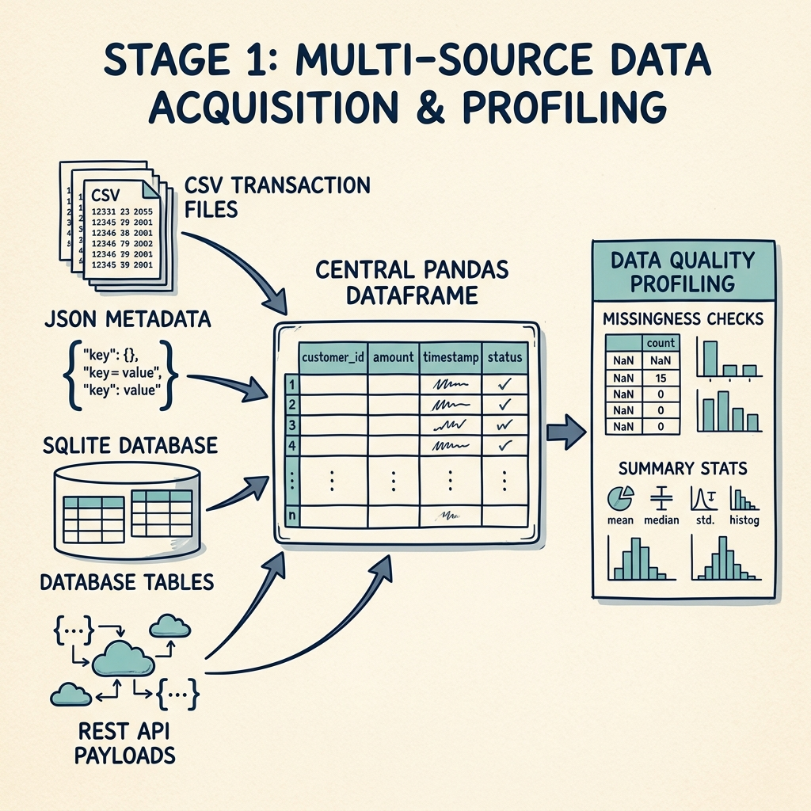
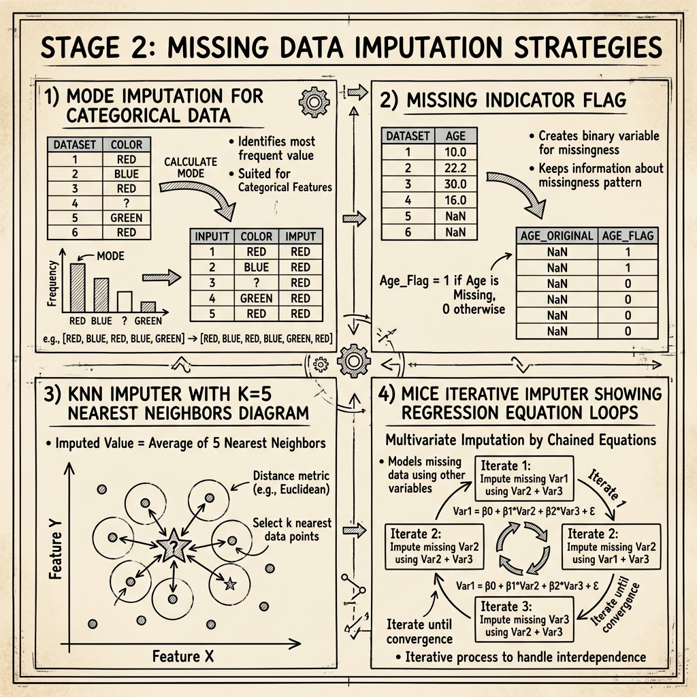
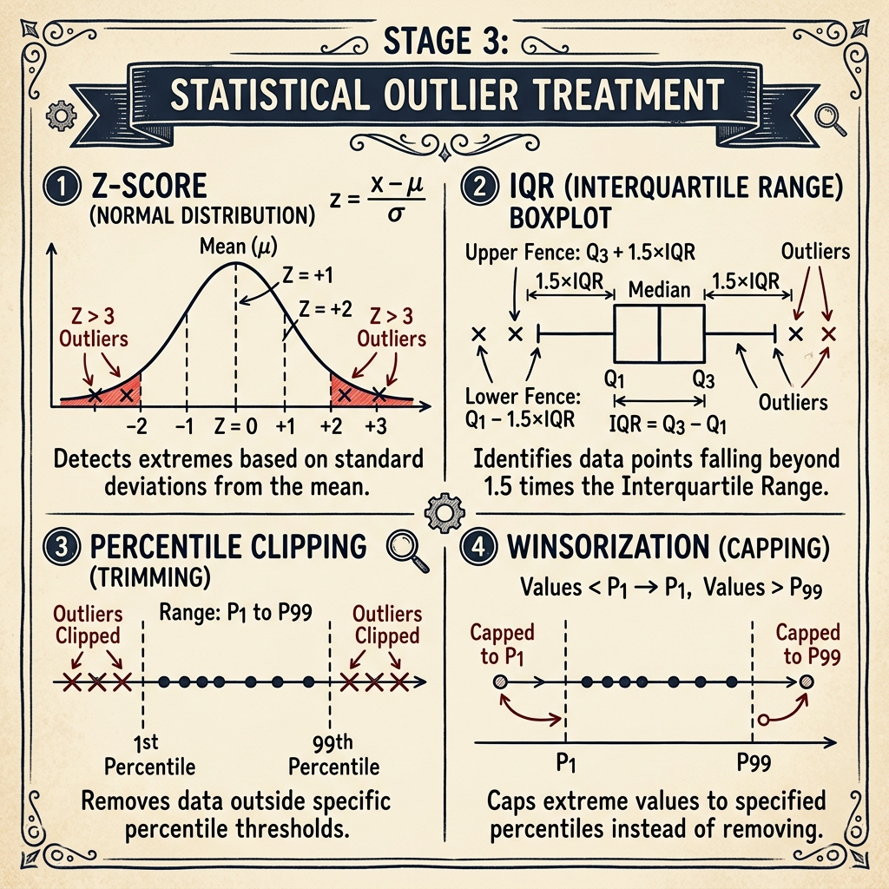
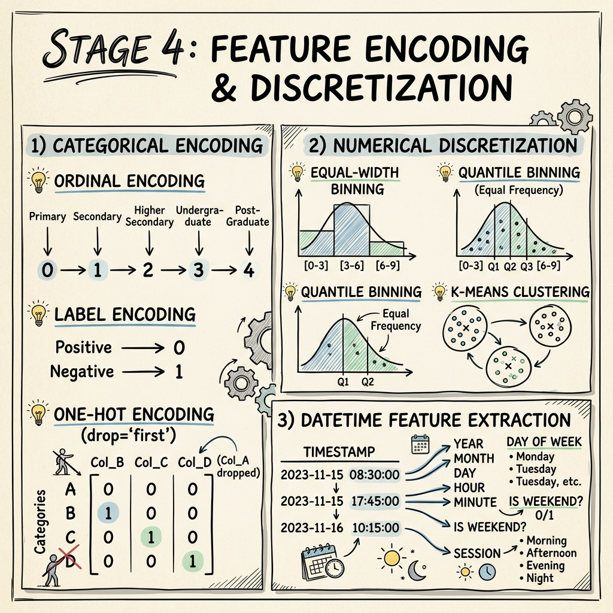
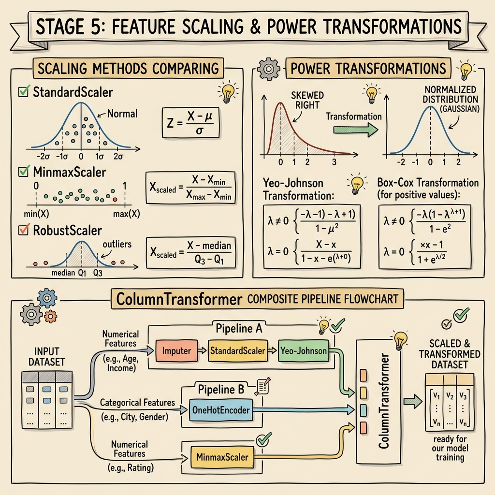
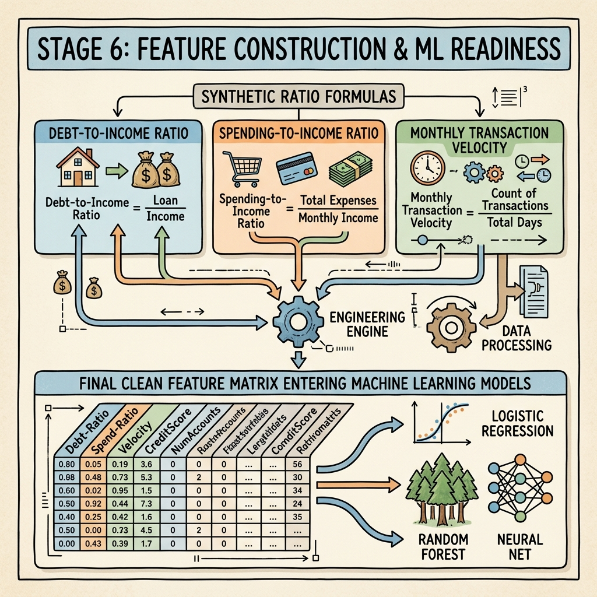

# 🔬 Data Preprocessing & Feature Engineering (DPFE) Master Pipeline

This directory contains the production-grade **Data Preprocessing & Feature Engineering Master Pipeline** (`a.ipynb`). It demonstrates multi-source data ingestion, automated data quality profiling, advanced missing value imputation, statistical outlier treatment, feature encoding, scaling, power transformations, and domain-specific feature construction.

---

## 📁 Directory Architecture

```
DPFE/final/
├── a.ipynb
├── README.md
├── Part_A_and_Question_15_Report.pdf
├── images/
│   ├── stage1_data_acquisition.png
│   ├── stage2_missing_imputation.png
│   ├── stage3_outlier_treatment.png
│   ├── stage4_feature_encoding.png
│   ├── stage5_scaling_transformations.png
│   └── stage6_feature_construction.png
├── data/
│   ├── main_transactions.csv
│   ├── customer_metadata.json
│   ├── repayment_history.db
│   ├── external_api_data.json
│   └── data.csv
└── report/
    └── data_quality_report.html
```

---

## 📥 Stage 1: Multi-Source Data Acquisition & Profiling



Data is ingested from four distinct data persistence channels and merged into a unified analytical DataFrame (`df`):

1. **CSV Ingestion**: `main_transactions.csv` containing `customer_id`, `loan_amount`, `loan_purpose`, `transaction_count`, `spending_ratio`, `default_flag`.
2. **JSON Parsing**: `customer_metadata.json` containing demographics (`age`, `gender`, `region`, `education_level`, `employment_type`, `join_date`).
3. **SQLite Database Querying**: `repayment_history.db` storing historical credit repayment scores.
4. **REST API Data**: `external_api_data.json` storing external macro-economic indicators.
5. **Data Quality Profiling**: Generated `report/data_quality_report.html` using `ydata_profiling.ProfileReport`.

---

## 🩹 Stage 2: Missing Data Imputation Strategies



Multiple univariate and multivariate missing data imputation methods were evaluated:

| Feature Type | Target Columns | Imputation Technique | Implementation Details |
| :--- | :--- | :--- | :--- |
| **Categorical** | `employment_type`, `gender` | `SimpleImputer` | `strategy='most_frequent'` (Mode substitution) |
| **Numerical** | `annual_income` | Missing Indicator + Random Sampling | Created `annual_income_missing_ind` binary flag + sampled values |
| **Numerical** | `numeric_columns` | `KNNImputer` | `n_neighbors=5` distance-weighted average |
| **Numerical (Production)**| `numeric_columns` | `IterativeImputer` (MICE) | `max_iter=10`, `random_state=42` multivariate regression imputation |

---

## ✂️ Stage 3: Statistical Outlier Detection & Treatment



To bound extreme tail variance without dropping rows, four statistical algorithms were implemented:

- **Z-Score Filter**: Identified extreme values where $|Z| > 3$ for `credit_score`.
- **IQR Capping**: Bounded `annual_income` between $[Q1 - 1.5 \times IQR, Q3 + 1.5 \times IQR]$.
- **Percentile Clipping**: Clipped `loan_amount` tails at the 1st (`0.01`) and 99th (`0.99`) percentiles.
- **Winsorization**: Applied `scipy.stats.mstats.winsorize` to `spending_ratio` with `limits=[0.01, 0.01]`.
- **Visual Validation**: Rendered Seaborn 4x2 boxplot grids to verify outlier neutralization.

---

## 🔠 Stage 4: Feature Encoding & Discretization



#### **Date/Time Feature Extraction**
- Converted `join_date` to `datetime` objects and extracted `join_year`, `join_month`, `join_day`, `join_weekday`.

#### **Categorical Encoding**
- **Ordinal Encoding**: `OrdinalEncoder` for `education_level` preserving hierarchical order (`Primary` < `Secondary` < `Graduate` < `Post-Graduate`).
- **Label Encoding**: `LabelEncoder` for binary `gender` column ($\rightarrow$ `gender_encoded`).
- **One-Hot Encoding**: `pd.get_dummies()` and `OneHotEncoder(drop='first')` for `region`, `loan_purpose`, and `employment_type` to eliminate dummy variable traps.

#### **Numerical Discretization / Binning**
- **Equal-Width Binning**: `pd.cut()` on `annual_income` and `repayment_history` into 3 bins (`Low`, `Medium`, `High`).
- **Binarization**: `Binarizer(threshold=700)` on `credit_score` ($\rightarrow$ `credit_score_binarized`).
- **Quantile Binning**: `pd.qcut()` on `transaction_count` into 4 equal-frequency quantiles.
- **K-Means Binning**: `KBinsDiscretizer(n_bins=4, encode='ordinal', strategy='kmeans')` on `transaction_count`.

---

## 📐 Stage 5: Feature Scaling & Power Transformations



#### **Feature Scaling**
- `StandardScaler`: Scaled `annual_income` and `loan_amount` to zero mean ($\mu=0$) and unit variance ($\sigma=1$).
- `MinMaxScaler`: Normalized numeric features to $[0, 1]$ interval.
- `RobustScaler`: Scaled features using median and IQR to resist remaining extreme values.
- `MaxAbsScaler` & `Normalizer`: Applied maximum absolute scaling and L2 row normalization.

#### **Power & Function Transformations**
- **Log Transformation**: `FunctionTransformer(np.log1p)` and `FunctionTransformer(np.sqrt)` on `spending_ratio`.
- **Box-Cox Transformation**: `PowerTransformer(method='box-cox')` on positive `loan_amount`.
- **Yeo-Johnson Transformation**: `PowerTransformer(method='yeo-johnson')` on `annual_income` to stabilize variance and achieve Gaussian distribution normality.

#### **ColumnTransformer Composite Pipeline**
- Combined numerical scaling (`StandardScaler`) and categorical encoding (`OneHotEncoder(drop='first')`) into a unified `ColumnTransformer` pipeline.

---

## 💡 Stage 6: Feature Construction & ML Readiness



Three domain-specific financial features were constructed to capture customer credit risk and financial behavior:

1. **`debt_to_income_ratio`** = `loan_amount / annual_income`  
   *Usefulness*: Quantifies borrower leverage and debt repayment capacity.
2. **`avg_monthly_transactions`** = `transaction_count / 12`  
   *Usefulness*: Standardizes transaction velocity into a monthly cadence.
3. **`spending_to_income_ratio`** = `spending_ratio / annual_income`  
   *Usefulness*: Measures discretionary spending burn rate relative to total income.

---

## 📊 Final Dataset Summary

- **Zero Missing Data**: Complete numerical and categorical data coverage after MICE imputation.
- **Normalized Distributions**: Gaussian-shaped numerical features via Yeo-Johnson/Box-Cox transformations.
- **No Multicollinearity**: One-hot dummy traps avoided (`drop='first'`).
- **ML Ready**: Fully encoded, scaled, bounded, and feature-engineered matrix ready for direct ingestion into Machine Learning models (Logistic Regression, Random Forest, XGBoost, Neural Networks).

---

# 👨‍💻 Author

**Ansh Patoliya**

**B.Tech Student | Data Analyst | AI/ML Enthusiast**

---