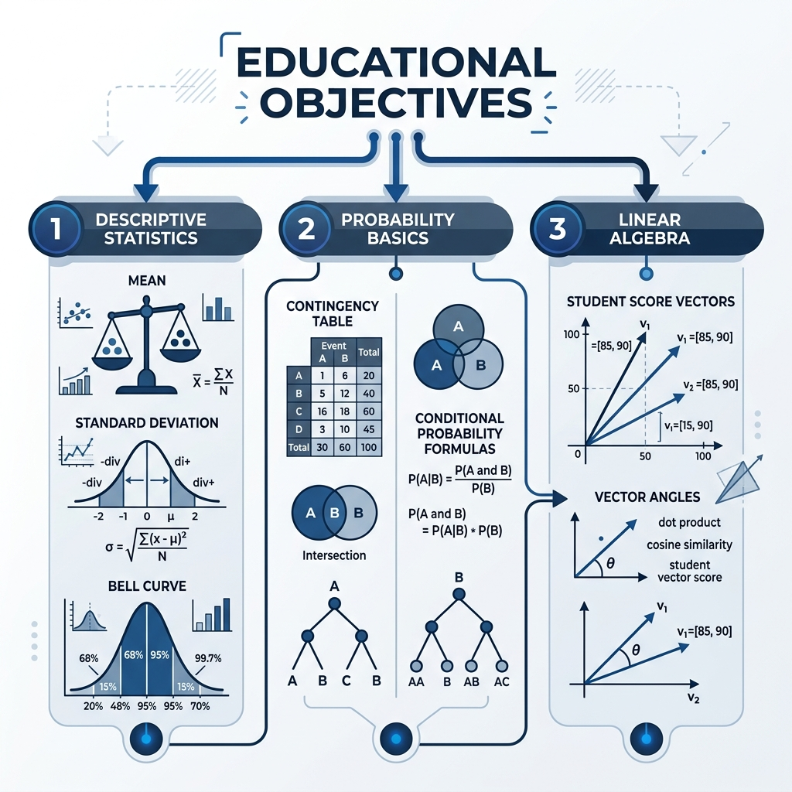

# 📊 Student Performance Analysis: Descriptive Statistics, Probability, & Linear Algebra

  

Welcome to the **Student Performance Analysis** project repository! This project applies foundational concepts of **Descriptive Statistics**, **Probability Theory**, and **Linear Algebra** to analyze, visualize, and model student academic performance data from a cohort of 5,000 students.

---

## 🎨 Project Overview & Pipeline

The following concept map and animated workflow pipeline show the analytical pillars and steps of this project at a glance:

### 📍 Concept Map

### 📍 Analysis Pipeline

  

---

## 🎯 Objectives
*   **Descriptive Statistics**: Calculate central tendencies (Mean, Median, Mode) and dispersions (Range, Variance, Standard Deviation) on academic grades.
*   **Probability Modeling**: Calculate marginal and conditional probabilities to examine features that directly influence student exam outcomes.
*   **Distribution & Visualization**: Visualize distribution structures (Skewness, Kurtosis, normality) using histograms, probability density curves, and Quantile-Quantile (Q-Q) plots.
*   **Linear Algebra**: Implement linear algebra vectors to compute directional similarities, lengths, and angles between different subject outcomes.

---

## 🛠️ Tech Stack & Libraries
*   **Python 3.x** / **Jupyter Notebook**
*   **Pandas**: For structured data frame loading and manipulation.
*   **NumPy**: Vector norms, dot products, and trigonometric angles.
*   **SciPy (stats)**: For probability plotting (Normal Q-Q plot calculations).
*   **Matplotlib**: Custom histograms, distributions, and probability plots.

---

## 📂 Core Analysis Steps

### 📐 Step 1: Measures of Central Tendency & Dispersion
This task describes the average performance and the spread of scores for Mathematics and Science.

#### 📊 Computed Metrics
*   **Mathematics Scores**:
    *   **Mean**: $64.40$ | **Median**: $65.00$ | **Mode**: $72.00$
*   **Science Scores**:
    *   **Range**: $72.00$ | **Variance ($s^2$)**: $192.07$ | **Standard Deviation ($s$)**: $13.86$

  

<b>📷 Click to view Jupyter Notebook Execution (Step 1)</b>

---

### 🧮 Step 2: Probability Basics
Probability basics evaluate the cohort's baseline success and examine the impact of studying habits.

#### 📊 Computed Metrics
*   **Baseline Passing Probability**: $P(\text{Pass\_Fail} = 1) = 84.22\%$
*   **Conditional Probability**: 
    $$P(\text{Pass\_Fail} = 1 \mid \text{Hours\_Studied} > 5) = \frac{4118}{270 + 4118} = 93.85\%$$

#### 📊 Contingency Table
| Pass / Fail | Studied $\le$ 5 Hours (False) | Studied > 5 Hours (True) |
| :--- | :---: | :---: |
| **Failed (0)** | 519 | 270 |
| **Passed (1)** | 93 | 4118 |

<b>📷 Click to view Jupyter Notebook Execution (Step 2)</b>

---

### 🌐 Step 3: Distribution & Visualization
We check the shapes of score distributions to evaluate normality and tail structures.

#### 📊 Computed Metrics
*   **Mathematics Scores**: Plotted with a histogram and standard normal distribution curve overlay.
*   **Science Scores**:
    *   **Skewness**: $-0.0118$ (virtually symmetric, very slight left tail).
    *   **Kurtosis**: $-0.7791$ (platykurtic distribution; flatter peak, thinner tails, suggesting uniform score spread).
*   **English Scores**: Evaluated using a Normal Q-Q plot to map sample quantiles against theoretical normal distribution quantiles.

  <table>
    <tr>
      <td align="center"><b>Math Distribution & Normal Curve</b></td>
      <td align="center"><b>English Score Normal Q-Q Plot</b></td>
    </tr>
    <tr>
      <td></td>
      <td></td>
    </tr>
  </table>

---

### 🔑 Step 4: Linear Algebra Representation
Individual student performance can be mapped as vectors in a multi-dimensional subject coordinate system. Using the first 5 students' scores:

#### 📊 Computed Metrics
*   **Math Vector ($\vec{u}$)**: $[48, 50, 46, 54, 36]$
*   **Science Vector ($\vec{v}$)**: $[54, 44, 53, 59, 53]$
*   **Dot Product ($\vec{u} \cdot \vec{v}$)**: $12,324$
*   **Vector Norms**: $\|\vec{u}\|_1 = 234.0$ (L1 Norm) | $\|\vec{u}\|_2 = 105.51$ (L2 Norm)
*   **Angle ($\theta$)**: $\theta = 8.54^{\circ}$ (High directional alignment indicates that student performance in Math and Science fluctuates proportionally).

  

<b>📷 Click to view Jupyter Notebook Execution (Step 4)</b>

---

## 📊 Key Results & Interpretations

1.  **Academic Alignment**: The extremely small angle of $8.54^{\circ}$ between Math and Science score vectors mathematically proves that students who excel in Mathematics are highly likely to perform similarly in Science.
2.  **Study Hours Matter**: The probability of passing increases from a baseline of $84.22\%$ to **$93.85\%$** if a student studies more than 5 hours. School programs should strongly incentivize study blocks.
3.  **Grade Symmetrical Calibrations**: Mathematics scores follow a clean bell-shape with virtually identical central parameters (Mean: 64.4, Median: 65), verifying robust curriculum design.

---

## 📁 Repository Deliverables
*   **[`final.ipynb`](final.ipynb)**: Complete Python code implementing statistics, probability, and linear algebra.
*   **[`MAS_Statistical_Report_v2.docx`](MAS_Statistical_Report_v2.docx)**: Professional Word report with embedded figures and formatted tables.
*   **[`students_scores.csv`](students_scores.csv)**: Dataset containing academic records of 5,000 students.
*   **[`readme.md`](readme.md)**: Structured project overview (this file).
