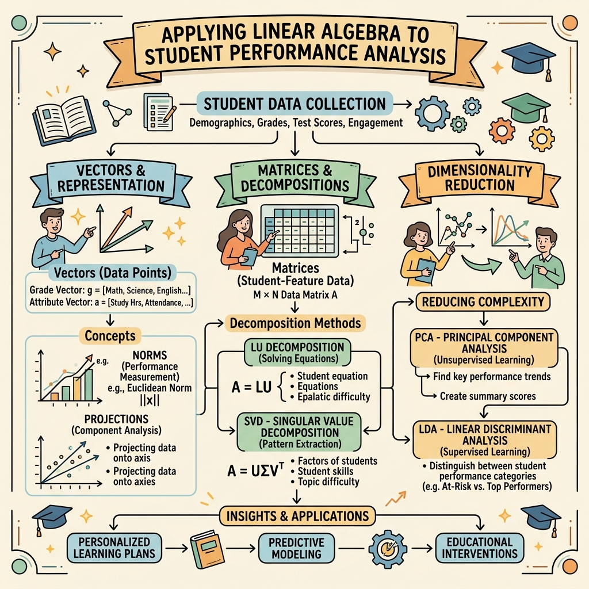
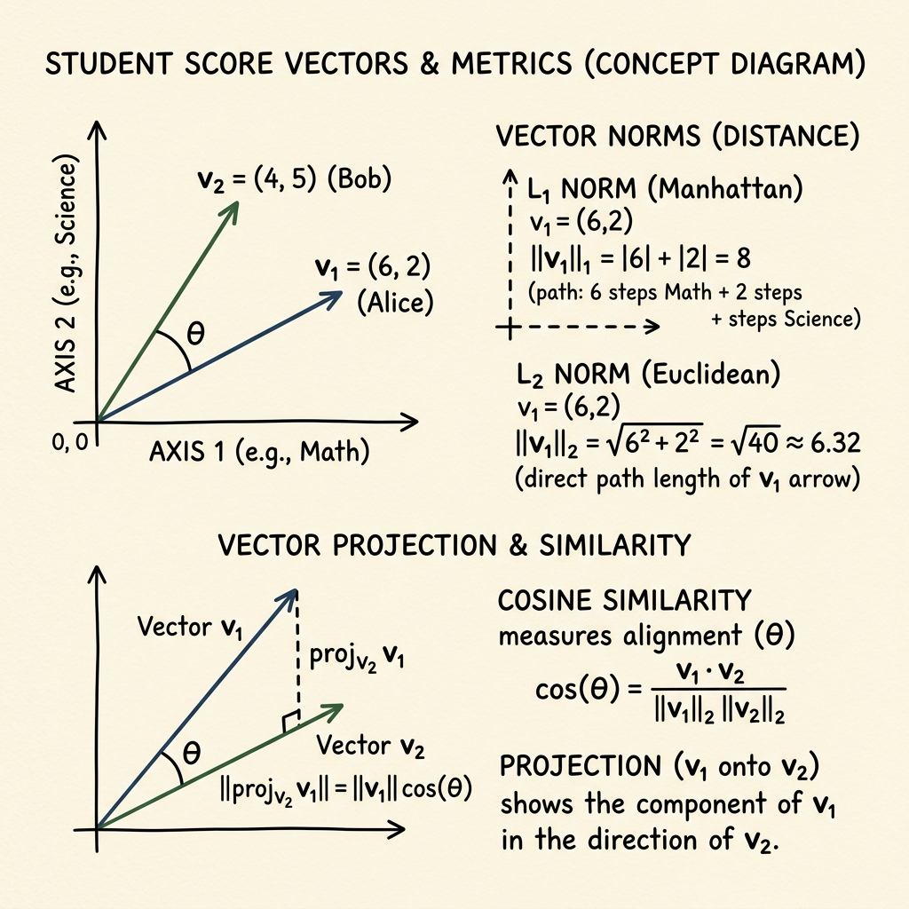
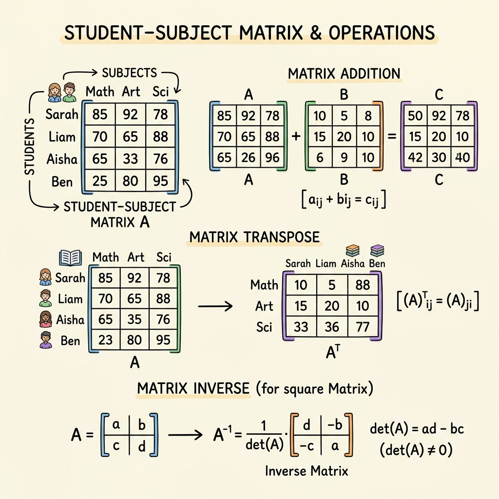
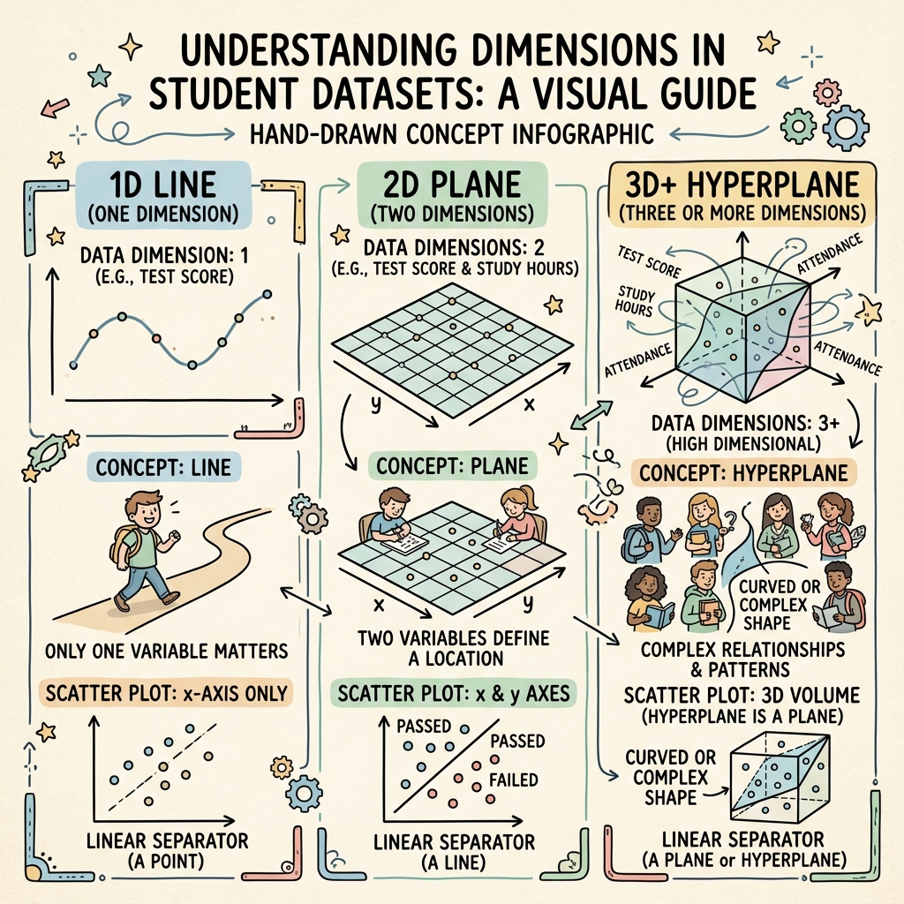
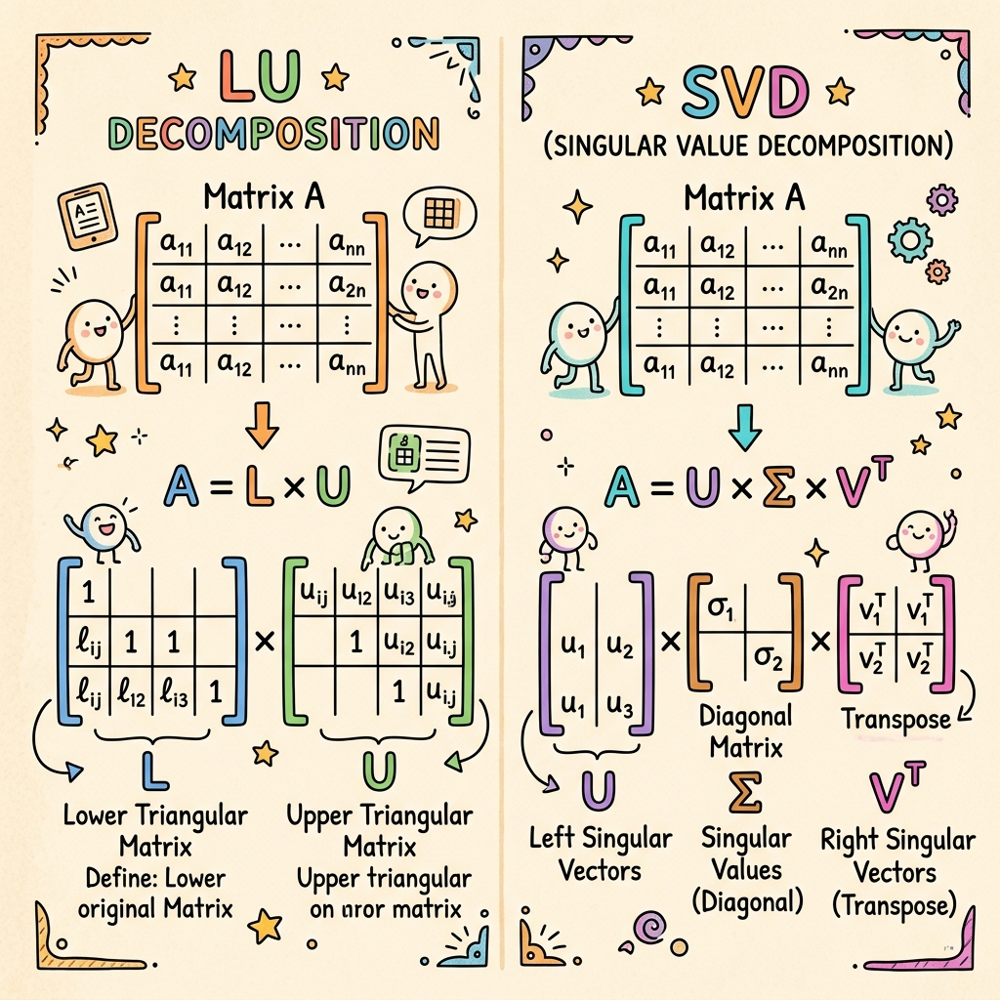
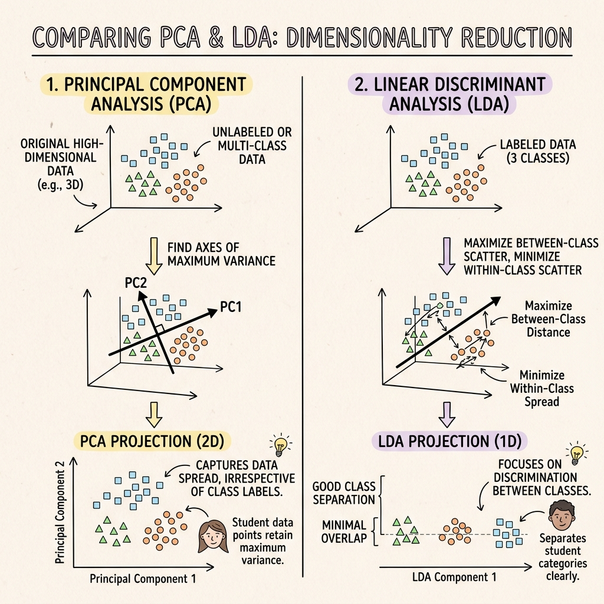

# 📊 Calculative Foundation: Student Performance Analysis using Linear Algebra

Welcome to the **Calculative Foundation** project repository! This project demonstrates how fundamental and advanced **Linear Algebra** concepts are applied to represent, manipulate, and analyze multidimensional student performance data. By bridging theory with practical Python implementation, this project serves as a comprehensive study in mathematical foundations widely utilized in Data Science, AI/ML, and Engineering.

---

## 🎨 Project Overview & Concept Map

Here is a conceptual illustration of how the linear algebra topics in this project connect with student data:

---

## 🎯 Objectives
*   Represent and manipulate multidimensional student academic scores using **vectors** and **matrices**.
*   Perform key vector operations including **norms (L1 & L2)**, **dot products**, **angles**, and **projections**.
*   Understand geometric dimensional spaces: **lines**, **planes**, and **hyperplanes** in the context of features.
*   Decompose student matrices using **LU Decomposition** and **Singular Value Decomposition (SVD)**.
*   Extract variance and classify performance using **Principal Component Analysis (PCA)** and **Linear Discriminant Analysis (LDA)**.

---

## 🛠️ Tech Stack & Libraries
*   **Python 3.x**
*   **Jupyter Notebook** (for interactive experimentation)
*   **NumPy**: High-performance vector/matrix operations and linear algebra routines.
*   **SciPy**: Specifically for scientific calculations like LU decomposition (`scipy.linalg.lu`).
*   **Pandas**: Structured data management and manipulation.
*   **Scikit-Learn**: Machine learning preprocessing (`StandardScaler`), PCA, and LDA.
*   **Matplotlib & Seaborn**: Static 2D/3D visualizations, scatter plots, and matrix heatmaps.

---

## 📂 Project Structure & Core Tasks

### 📐 Part A: Vector & Matrix Fundamentals
Each student's subject scores are mapped as a vector in $N$-dimensional space:
$$\vec{v} = [x_{\text{Math}}, y_{\text{Science}}, z_{\text{English}}, \dots]$$

*   **Vector Norms**:
    *   **L1 Norm (Manhattan Norm)**: Calculated as $\sum |x_i|$, representing the total absolute points scored across all subjects.
    *   **L2 Norm (Euclidean Norm)**: Calculated as $\sqrt{\sum x_i^2}$, representing the overall academic magnitude or strength of a student.
*   **Dot Product & Similarity**: Used to compute the alignment between two students' performance vectors:
    $$\vec{u} \cdot \vec{v} = \|\vec{u}\| \|\vec{v}\| \cos(\theta)$$
*   **Vector Projection**: Measures how much of student A's performance profile maps onto student B's profile:
    $$\text{proj}_{\vec{v}}(\vec{u}) = \frac{\vec{u} \cdot \vec{v}}{\|\vec{v}\|^2} \vec{v}$$

### 🧮 Part B: Matrix Operations
We compile student scores into a Student-Subject Matrix $A \in \mathbb{R}^{M \times N}$, where $M$ is the number of students and $N$ is the number of subjects.

*   **Matrix Multiplication**: Computes interaction matrices (e.g., $A \cdot A^T$ to find student-to-student similarity).
*   **Transpose ($A^T$)**: Swaps rows and columns to enable subject-centric analysis.
*   **Determinant & Inverse**: Used to evaluate the linear independence of subject features (for square sub-matrices).
*   **Visual Representation**: Illustrated using a structured heatmap with value annotations.

### 🌐 Part C: Linear Transformations & Geometry
Understanding dimensions in academic records:

*   **Line (1D Space)**: Representing students with only 1 subject score (a single axis).
*   **Plane (2D Space)**: Representing student positions based on 2 subjects (Math vs. Science).
*   **Space (3D Space)**: Visualizing student scores across 3 subjects in a 3D coordinate system.
*   **Hyperplane ($N$-D Space)**: When analyzing 4 or more subjects, we utilize hyperplanes (a flat subspace of dimension $N-1$) as decision boundaries to segment students.

### 🔑 Part D: Eigenvalues & Decomposition
*   **Covariance Matrix & Eigenvalues**: Computing eigenvalues ($\lambda$) and eigenvectors ($\vec{v}$) of the covariance matrix:
    $$\Sigma \vec{v} = \lambda \vec{v}$$
    This exposes the directions (eigenvectors) along which the student variance is maximized.

*   **LU Decomposition**: Factorizes the matrix into Lower ($L$) and Upper ($U$) triangular components:
    $$P \cdot A = L \cdot U$$
    This is highly efficient for solving systems of linear equations.
*   **Singular Value Decomposition (SVD)**: Decomposes the non-square student matrix:
    $$A = U \Sigma V^T$$
    SVD reveals latent topics/traits in student performance, serving as the basis for recommendation systems and dimensionality reduction.

### 📉 Part E: Dimensionality Reduction
*   **Principal Component Analysis (PCA)**: Standardizes the dataset and projects the 5-subject data onto 2 orthogonal principal components (PC1 & PC2) while preserving maximum variance.
*   **Linear Discriminant Analysis (LDA)**: Supervised dimensionality reduction that projects the dataset onto 1 dimension (LD1) to maximize class separation between "Above Average" and "Below Average" students.

---

## 📊 Key Results & Interpretations

1.  **Vector Projections & Similarity**:
    *   The angle $\theta$ between similar high-performing students is very small ($\cos\theta \approx 0.999$), indicating highly aligned performance profiles across subjects.
2.  **LU and SVD Decompositions**:
    *   LU Decomposition successfully factors the matrix, simplifying linear system solving.
    *   SVD successfully captures latent parameters, expressing student profiles using singular values.
3.  **Dimensionality Reduction**:
    *   **PCA** shows that the first principal component (PC1) accounts for almost all variance, suggesting that overall student competence is the dominant factor.
    *   **LDA** projects student dimensions onto a single line (LD1) with a clear separation boundary, making it highly effective for classifying students as "Above Average" or "Below Average".

---

## 📁 Repository Deliverables
*   **`Calculative_Foundation.ipynb`**: Complete Python implementation with outputs and plots.
*   **`readme.md`**: Project overview, guide, and infographic.
*   **`theory.pdf`**: PDF document explaining core linear algebra definitions, formulas, and proofs.