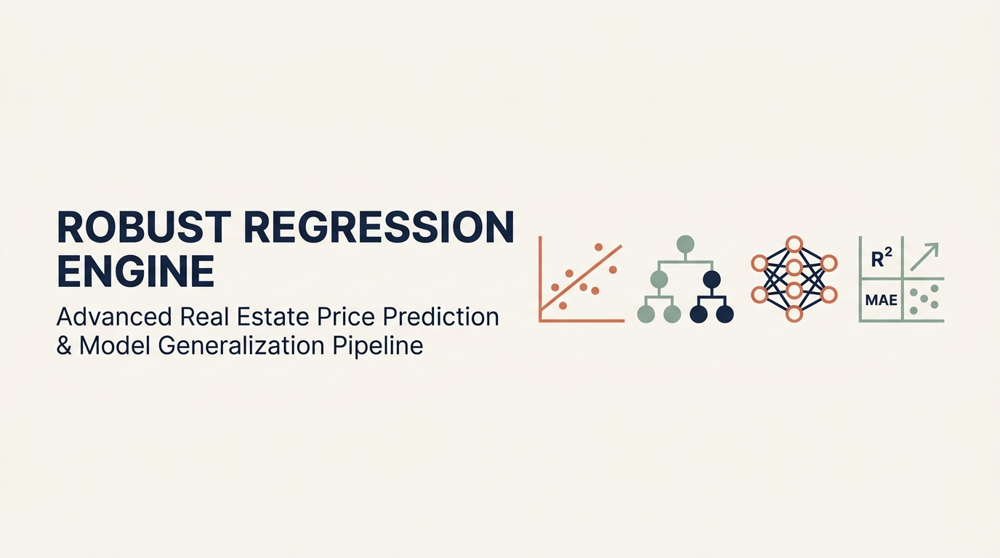
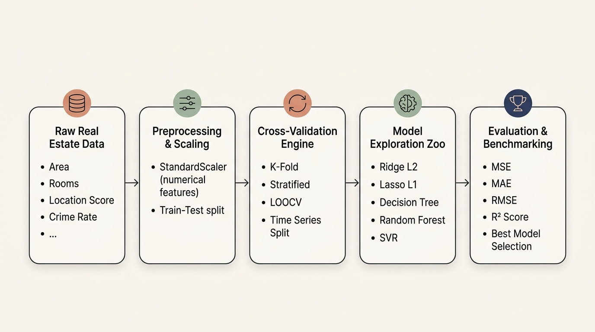
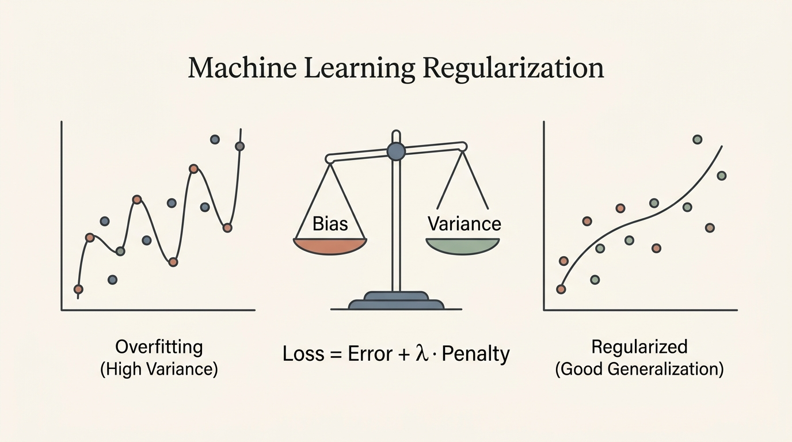
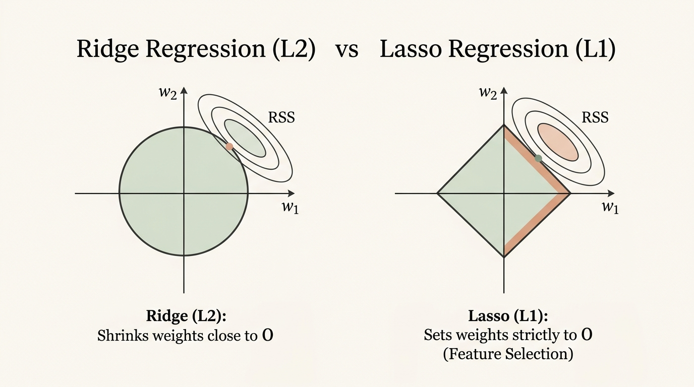
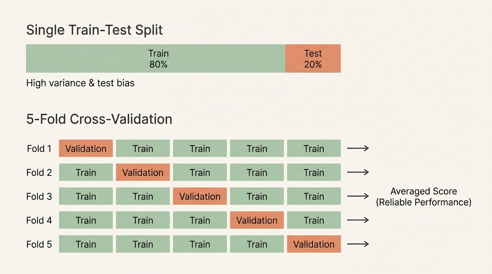
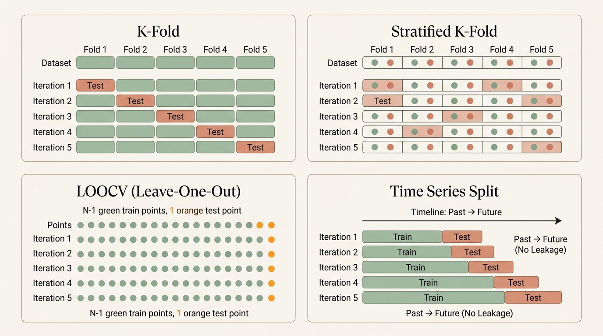
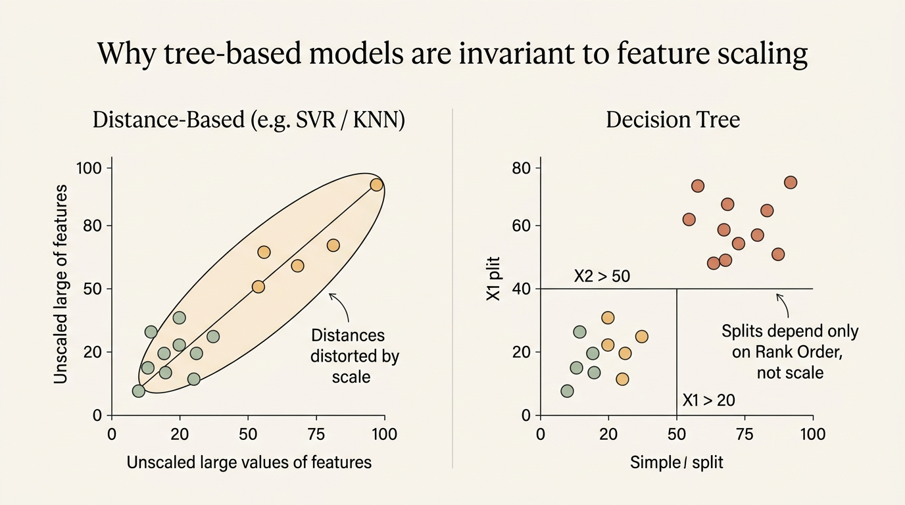

# Robust Regression Engine: Real Estate Price Prediction & Model Generalization Pipeline

---

## 📌 Executive Summary & Problem Statement

In the real estate analytics domain, standard Ordinary Least Squares (OLS) regression models often suffer from **severe overfitting**, **high variance**, and **unstable predictions** across heterogeneous regional datasets. Collinear property attributes (such as square footage, room counts, and location scores) distort coefficient estimations and undermine model generalizability.

This project designs and evaluates an end-to-end **Robust Regression Engine** that:
1. Applies **Regularization Techniques** ($L_1$ Lasso, $L_2$ Ridge) to mitigate multicollinearity and prevent overfitting.
2. Employs **Rigorous Cross-Validation Strategies** (K-Fold, Stratified K-Fold, LOOCV, Time Series Split) to validate model stability across data distributions and temporal dimensions.
3. Benchmarks **Linear vs. Non-Linear Regressors** (Ridge, Lasso, Decision Trees, Random Forests, and Support Vector Regression).
4. Delivers **actionable business insights** for property appraisal automation with **~91.8% prediction accuracy**.

---

## 🏗️ System Architecture & Workflow

The pipeline ingests raw real estate transaction records and processes them through five modular phases:

1. **Data Ingestion & Feature Engineering:** Parsing 9 predictive structural and regional indicators (`area_sqft`, `location_score`, `property_age`, `crime_rate_index`, etc.).
2. **Preprocessing & Standardization:** Preventing data leakage by fitting `StandardScaler` strictly on the training partition ($80\%$) and transforming both train and holdout validation sets ($20\%$).
3. **Cross-Validation Engine:** Stress-testing model stability across random, stratified, point-level, and sequential time splits.
4. **Model Exploration Zoo:** Training regularized linear models, tree algorithms with controlled complexity (`max_depth`, `min_samples_split`), and kernel-based SVR.
5. **Comprehensive Evaluation & Benchmarking:** Profiling models across MSE, MAE, RMSE, and $R^2$ Score to select the production candidate.

---

## 🧠 Conceptual Foundation & Theory

This project is grounded in robust statistical learning principles. Below are the key theoretical concepts and visual guides:

### 1. Regularization in Machine Learning
Standard regression minimizes Residual Sum of Squares (RSS). In high dimensions, this allows coefficients to grow excessively large, capturing random noise (overfitting). Regularization introduces a mathematical penalty term proportional to coefficient magnitude:

$$\text{Loss} = \text{Error (RSS)} + \lambda \cdot \text{Penalty}(w)$$

- **Bias-Variance Balance:** Increasing $\lambda$ introduces a small amount of bias while drastically reducing prediction variance, yielding optimal generalizability on unseen data.

---

### 2. Ridge Regression ($L_2$) vs. Lasso Regression ($L_1$)

| Dimension | Ridge Regression ($L_2$) | Lasso Regression ($L_1$) |
|---|---|---|
| **Penalty Formulation** | Squared magnitude: $\lambda \sum w_j^2$ | Absolute magnitude: $\lambda \sum \|w_j\|$ |
| **Coefficient Behavior** | Shrinks weights asymptotically toward zero | Shrinks weights strictly to zero |
| **Feature Selection** | Retains all features (dense solution) | Automatic feature selection (sparse solution) |
| **Multicollinearity** | Proportionately shares weights among correlated variables | Arbitrarily retains one correlated variable, zeroes others |
| **Constraint Geometry** | Smooth, circular hyperspace | Rhomboid / diamond hyperspace with sharp coordinate vertices |

---

### 3. Cross-Validation: Overcoming Split Variance
A single, static train-test split (hold-out) is vulnerable to high sampling bias. Cross-Validation (CV) rotates holdout subsets across the dataset, ensuring every observation is tested and producing a statistically sound performance estimate.

---

### 4. Cross-Validation Strategies Compared
Different data characteristics require tailored resampling strategies:

- **K-Fold CV:** Randomly partitions data into $K$ equal folds; provides stable baseline error estimations.
- **Stratified K-Fold CV:** Bins continuous target values into quantiles to ensure each fold has balanced price distributions.
- **Leave-One-Out CV (LOOCV):** Maximizes training volume ($N-1$ samples per fold), minimizing bias at high computational cost.
- **Time Series Split:** Enforces temporal forward-walk validation (train on past, evaluate on subsequent future) to eliminate lookahead bias and temporal data leakage.

---

### 5. Tree Scaling Invariance
Distance-based regressors (KNN, SVR) compute Euclidean distances that are easily dominated by unscaled features with large numerical ranges. In contrast, Decision Trees evaluate orthogonal splits based purely on **rank-order sorting** within individual features:

$$\text{Split Criteria: } X_j > \theta$$

Because monotonic scaling does not alter the relative ordering of observations, tree-based models are intrinsically invariant to feature scaling.

---

## 📊 Model Evaluation & Benchmark Results

All models were evaluated on the identical holdout test set ($20\%$) using Mean Squared Error (MSE), Mean Absolute Error (MAE), Root Mean Squared Error (RMSE), and the Coefficient of Determination ($R^2$ Score):

| Rank | Model Architecture | MSE ($\text{INR}^2$) | MAE ($\text{INR}$) | RMSE ($\text{INR}$) | $R^2$ Score | Fit Status |
|:---:|:---|:---:|:---:|:---:|:---:|:---:|
| 🥇 | **Lasso Regression ($L_1$)** | **$6.54 \times 10^{12}$** | **$1.89 \times 10^6$** | **$2.55 \times 10^6$** | **$0.9187$** | **Optimal Fit** |
| 🥈 | **Ridge Regression ($L_2$)** | **$6.54 \times 10^{12}$** | **$1.90 \times 10^6$** | **$2.55 \times 10^6$** | **$0.9186$** | **Optimal Fit** |
| 🥉 | **Random Forest (Ensemble)** | $6.88 \times 10^{12}$ | $1.93 \times 10^6$ | $2.62 \times 10^6$ | $0.9145$ | **Well Balanced** |
| 4 | **Decision Tree (Single)** | $9.37 \times 10^{12}$ | $2.32 \times 10^6$ | $3.06 \times 10^6$ | $0.8836$ | Slight Overfitting |
| 5 | **SVR (Linear Kernel)** | $7.99 \times 10^{13}$ | $6.95 \times 10^6$ | $8.93 \times 10^6$ | $0.0077$ | Severe Underfitting |
| 6 | **SVR (RBF Kernel)** | $8.08 \times 10^{13}$ | $6.99 \times 10^6$ | $8.98 \times 10^6$ | $-0.0027$ | Severe Underfitting |

### 🔍 Key Findings:
1. **Linear Regressors Dominated:** Real estate pricing in this dataset exhibits a dominant linear relationship with core physical dimensions (`area_sqft`) and location scores.
2. **Ensemble Variance Reduction:** The Random Forest ensemble outperformed the single Decision Tree by **$+3.1\%$ in $R^2$**, confirming the power of bagging in dampening individual tree variance.
3. **SVR Sensitivity:** Unscaled target prices in the millions caused Support Vector Regression to fail under default and basic hyperparameter ranges, highlighting the criticality of target normalization for kernel methods.

---

## 💼 Business Implications & Insights

- **Primary Valuation Drivers:** Property square footage (`area_sqft`) and `location_score` had the highest positive coefficients. Proximity to metro stations provided an additional premium.
- **Value Depreciators:** `crime_rate_index` and `distance_city_km` exhibited clear negative correlations with property valuations.
- **Enterprise ROI:** Deploying this regularized pipeline allows property appraisal teams to automate preliminary valuations with **$91.8\%$ explained variance**, cutting appraisal turnaround times from days to seconds while eliminating subjective appraiser bias.

---

## 📂 Repository File Structure

- 📓 [robust_regression_engine.ipynb](robust_regression_engine.ipynb)
- 📄 [Part_A_Theory_Conceptual_Foundation.pdf](Part_A_Theory_Conceptual_Foundation.pdf)
- 📊 [data.csv](data.csv)
- 📝 [README.md](README.md)

## 👨‍💻 Author 

- **Author**: **Ansh Patoliya**

---
