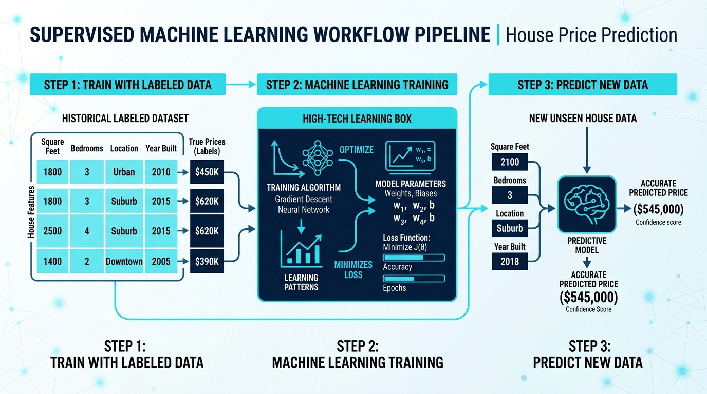
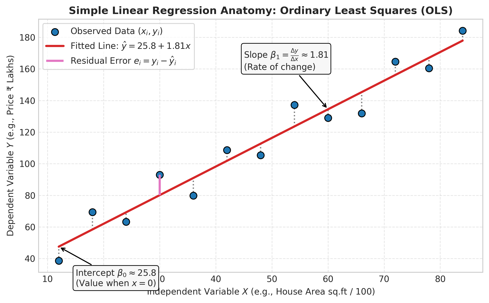
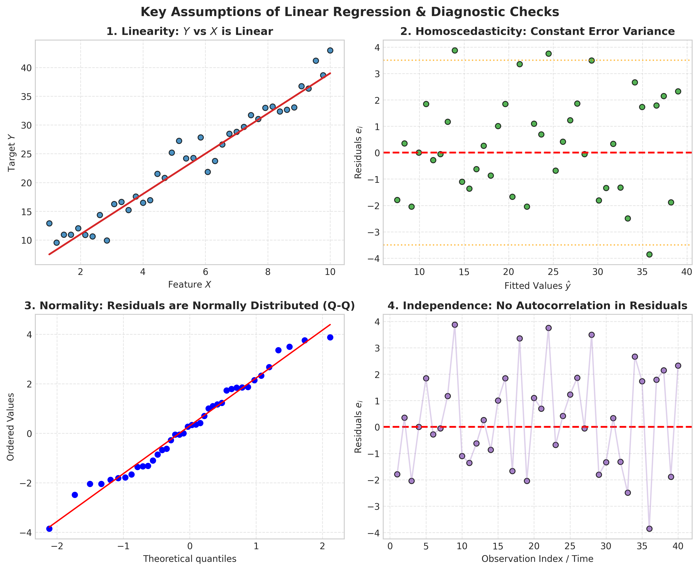
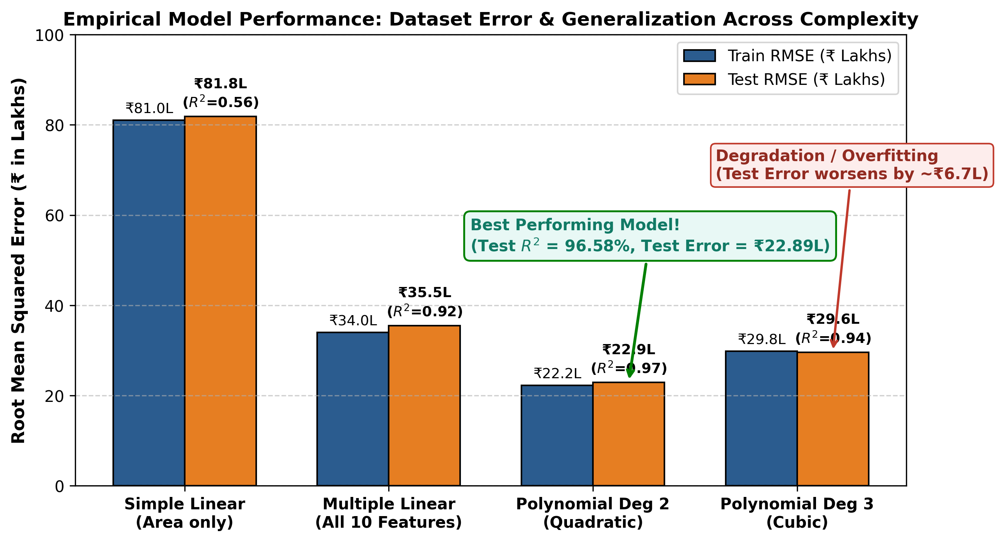
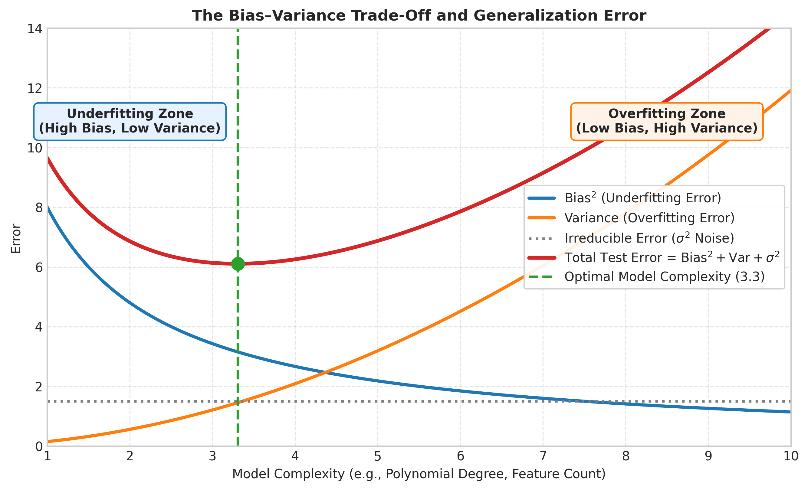
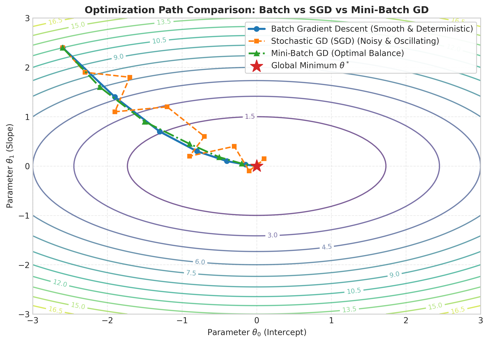

# 🏠 Predictive Insight Engine: House Price Valuation & Optimization

A comprehensive end-to-end Supervised Machine Learning practical implementation exploring regression architectures, Gauss-Markov assumption diagnostics, gradient descent optimization from scratch, and bias-variance tradeoff diagnostics on real estate housing valuations.

  
   
  <em>Figure 1: End-to-End Supervised Machine Learning Workflow Pipeline (Data Ingestion → Model Training & Optimization → Accurate Valuation)</em>

---

## 📌 Project Overview

The **Predictive Insight Engine** models property prices based on structural and geographical features. The repository evaluates parametric linear modeling versus polynomial expansion and investigates first-order iterative optimization algorithms versus analytical Ordinary Least Squares (OLS).

### Key Highlights:
- **Comprehensive Exploration**: Simple Linear Regression, Multiple Linear Regression, and High-Degree Polynomial Regression.
- **Statistical Assumption Validation**: Rigorous verification of Gauss-Markov OLS assumptions (Linearity, Homoscedasticity, Normality, Independence).
- **Optimization from Scratch**: Custom implementations of **Batch Gradient Descent**, **Stochastic Gradient Descent (SGD)**, and **Mini-Batch Gradient Descent**.
- **Model Diagnostics**: Bias-Variance tradeoff analysis, learning curves, and generalization gap identification.
- **Actionable Business Insights**: Feature attribution revealing marginal valuations for square footage, location scores, and amenities.

---

## 📊 Dataset Description

The analysis uses a structured real estate dataset containing **4,200 properties** partitioned into an **80% Training Set (3,360 samples)** and a **20% Testing Set (840 samples)**.

| Feature Name | Type | Description |
| :--- | :---: | :--- |
| `area_sqft` | Numerical | Built-up area of the house (sq.ft) |
| `bedrooms` | Numerical | Total count of bedrooms |
| `bathrooms` | Numerical | Total count of bathrooms |
| `location_score` | Numerical | Micro-market locality rating (1.0 to 10.0 scale) |
| `age_years` | Numerical | Property age since construction |
| `distance_city_km`| Numerical | Proximity to downtown city center (km) |
| `lot_size_sqft` | Numerical | Total land parcel / lot area (sq.ft) |
| `has_garage` | Binary | Presence of enclosed parking garage (0 or 1) |
| `has_pool` | Binary | Presence of private swimming pool (0 or 1) |
| `renovation_years_ago` | Numerical | Years elapsed since the last structural upgrade |
| **`house_price_inr`** | **Target** | **Actual transaction price (Dependent Variable)** |

---

## 📈 Simple Linear Regression & Assumption Diagnostics

We first evaluated Simple Linear Regression modeling price exclusively from `area_sqft`:
$$\text{House Price (INR)} = -1,163,519.18 + (14,788.31 \times \text{House Area})$$

  
   
  <em>Figure 2: Ordinary Least Squares (OLS) Geometry showing Slope ($+₹14,788.31/	ext{sq.ft}$), Intercept, and Residual Deviations</em>

### Gauss-Markov Assumption Diagnostics
To verify that Ordinary Least Squares estimators are **BLUE** (Best Linear Unbiased Estimators), a 4-quadrant diagnostic check was performed:

  
   
  <em>Figure 3: Four-Quadrant Diagnostic Suite: Linearity, Homoscedasticity, Normality (Q-Q Plot), and Residual Independence</em>

---

## 🏆 Model Performance Leaderboard & Diagnostics

All models were evaluated on the unseen test dataset ($n = 840$):

| Model Architecture | Train RMSE | Test RMSE | Test MAE | Test $R^2$ | Diagnostic Verdict |
| :--- | :---: | :---: | :---: | :---: | :--- |
| **Simple Linear Regression** *(Area only)* | ₹81.04 L | ₹81.85 L | ₹62.95 L | 0.5625 | High Bias (Underfitting) |
| **Multiple Linear Regression** *(All 10)* | ₹34.00 L | ₹35.49 L | ₹26.05 L | 0.9178 | Balanced & Interpretable |
| **Polynomial Regression (Degree 2)** | **₹22.23 L** | **₹22.89 L** | **₹17.12 L** | **0.9658** | **Champion Model (Optimal Fit)** |
| **Polynomial Regression (Degree 3)** | ₹29.80 L | ₹29.58 L | ₹22.40 L | 0.9429 | High Variance (Overfitting onset) |

  
   
  <em>Figure 4: Empirical Model Performance Across Complexity: Degree 2 achieves optimal generalization, whereas Degree 3 exhibits error degradation</em>

> 💡 **Takeaway:** Quadratic Polynomial Regression achieved the highest accuracy ($R^2 = 96.58\%$) by capturing non-linear interactions between area and location score. Expanding to Degree 3 triggered parameter explosion (55+ terms), degrading out-of-sample performance by ₹6.69 Lakhs.

---

## ⚖️ The Bias-Variance Trade-Off

The theoretical generalization error decomposes into:
$$\text{Expected Test MSE} = \text{Bias}^2 + \text{Variance} + \sigma^2$$

  
   
  <em>Figure 5: Theoretical Bias–Variance Curve highlighting the Optimal Model Complexity Sweet Spot</em>

---

## ⚙️ Gradient Descent Optimization from Scratch

Implemented first-order iterative optimization to minimize Mean Squared Error cost:
$$J(\theta) = \frac{1}{2m} \sum_{i=1}^{m} (h_\theta(x^{(i)}) - y^{(i)})^2$$

Parameter update rule: $\theta_j := \theta_j - \alpha \frac{\partial J(\theta)}{\partial \theta_j}$ with learning rate $\alpha = 0.01$ and Z-score feature standardization.

### Empirical Benchmarks:
| Optimizer Variant | Batch Size | Epochs | Wall Time | Final MSE | Convergence Trajectory |
| :--- | :---: | :---: | :---: | :---: | :--- |
| **Batch Gradient Descent** | 3,360 (Full) | 150 | **0.0093 s** | $1.1668 \times 10^{13}$ | Smooth, deterministic descent |
| **Mini-Batch GD (batch=32)**| 32 samples | 100 | 0.1587 s | **$1.1637 \times 10^{13}$** | **Fastest loss reduction & lowest MSE** |
| **Stochastic GD (SGD)** | 1 sample | 80 | 1.2172 s | $1.3231 \times 10^{13}$ | Noisy, oscillating trajectory |

  
   
  <em>Figure 6: Optimization Trajectories: Smooth Batch GD vs. Erratic SGD vs. Balanced Mini-Batch GD</em>

---

## 📈 Real Estate Valuation Multipliers

Learned regression coefficients from Multiple Linear Regression provide direct economic interpretations for property appraisal:

- 📐 **Area Multiplier**: $+₹13,795.94$ per additional sq.ft ($+₹13.80\text{ Lakhs}$ per 100 sq.ft).
- 📍 **Location Score**: $+₹30,73,174.00$ per 1-point increase on the 10-point locality index (highest pricing factor).
- 🛏️ **Bedrooms**: $+₹1,97,643.10$ per additional bedroom.
- 🚿 **Bathrooms**: $+₹1,85,944.50$ per additional bathroom.
- 🏊 **Swimming Pool**: $+₹4,55,290.20$ valuation premium.
- 🚗 **Garage**: $+₹93,924.36$ valuation premium.
- ⏳ **Age Depreciation**: $-₹65,609.24$ annually in property wear-and-tear.
- 🛣️ **City Distance**: $-₹98,965.16$ value penalty per kilometer from downtown.
- 🔨 **Renovation Decay**: $-₹21,435.91$ annual penalty since last refurbishment.

---

## 📁 Repository Structure

- 📂 [**`images/`**](images)
- 📊 [**`data.csv`**](data.csv)
- 📓 [**`predictive_insight_engine.ipynb`**](predictive_insight_engine.ipynb)
- 📝 [**`README.md`**](README.md)

---

## 📑 Companion Theory Documentation

A complete, publication-grade academic theory report with mathematical proofs, comprehensive evaluation interpretations, and Gauss-Markov diagnostic discussions is available in the root workspace:
- 📄 [**`Machine_Learning_Theory_Report.pdf`**](../Machine_Learning_Theory_Report.pdf)

---

## 👨‍💻 Author & Project Credits

- **Author**: **Ansh Patoliya**
- **Project**: Predictive Insight Engine
- **Domain**: Supervised Learning (Regression & Optimization)
- **Status**: Verified & Completed
