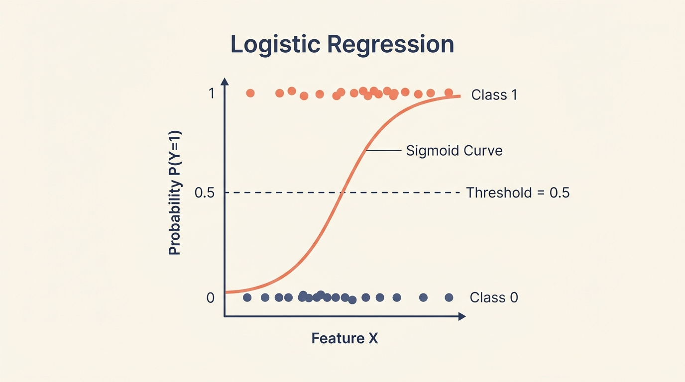
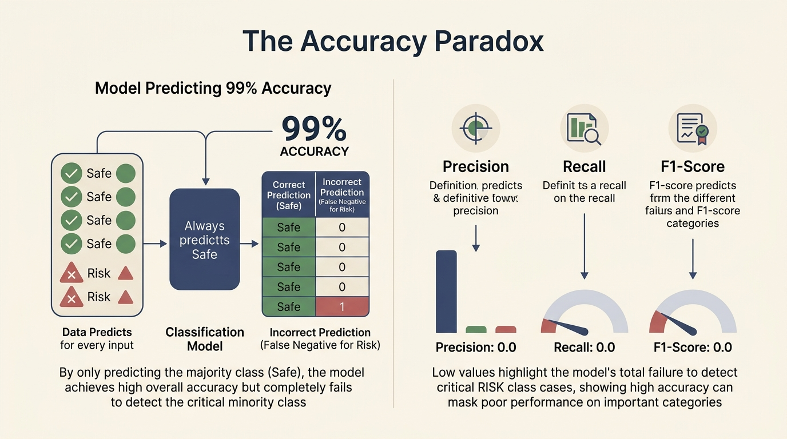
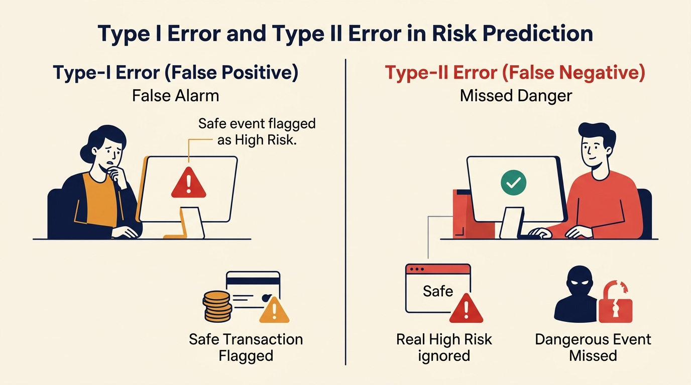
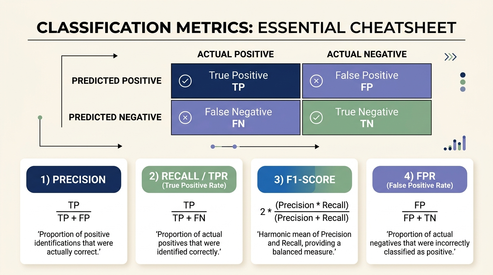
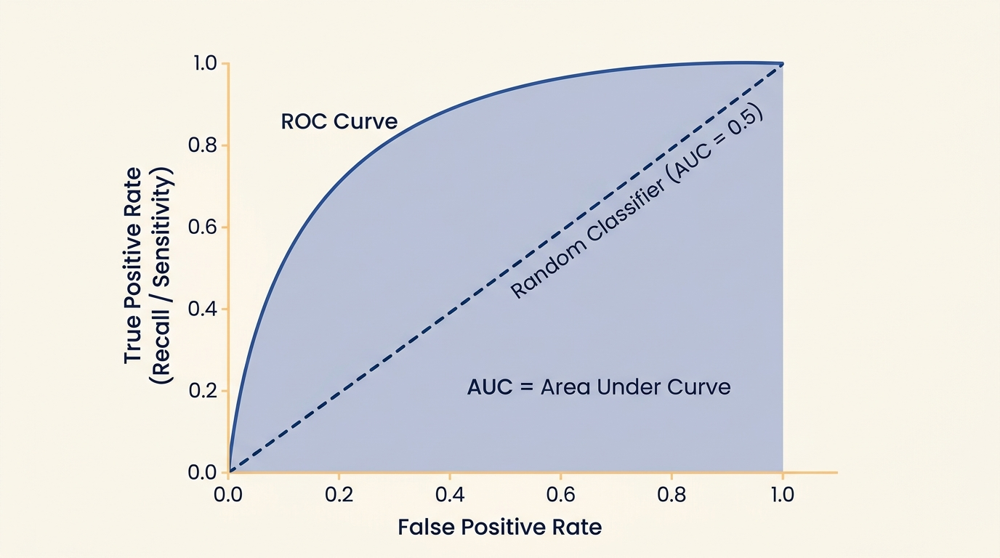
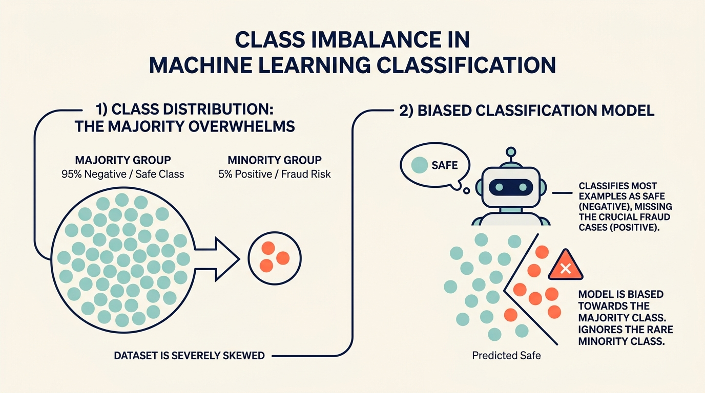

# 🚨 Risk Alert Classification & Model Evaluation


An end-to-end Machine Learning practical project focusing on **Risk Alert Classification**, handling severe **Class Imbalance**, hyperparameter tuning, and comprehensive model evaluation using industry-standard performance metrics.

---


## 📖 Project Overview

In real-world risk management (financial transactions, equipment monitoring, cyber security, healthcare), abnormal risk events occur rarely. A standard machine learning model can easily be misled by the sheer volume of normal events. 

This project demonstrates:
1. Identifying and mitigating **class imbalance** (88.2% safe vs. 11.8% risk).
2. Implementing and tuning **Logistic Regression**, **Decision Trees**, and **Random Forests**.
3. Minimizing **False Negatives** (missed risks) while maintaining high precision and generalization.

---

## 🧠 Part A: Conceptual Understanding & Visual Guides

### 1. Logistic Regression & Sigmoid Function
* **Definition:** A supervised learning classification algorithm that estimates the probability of a categorical outcome (e.g., Risk vs. Safe).
* **Suitability:** It uses the **Sigmoid (logistic) function** to map any real number to a probability value strictly between `0` and `1`. A decision threshold (typically 0.5) converts this continuous probability into a discrete class label.

<p align="center">
  
</p>

---

### 2. The Accuracy Paradox & Evaluation Metrics
* **Why Accuracy Fails:** In skewed datasets, a naive model that predicts only the majority class can easily achieve **98%+ accuracy** while failing to detect a single high-risk event.
* **Solution:** Multi-metric evaluation using Precision, Recall, F1-Score, and AUC-ROC ensures the minority class is evaluated fairly.

<p align="center">
  
</p>

---

### 3. Type-I vs. Type-II Errors in Risk Prediction
* **Type-I Error (False Positive):** Model predicts high risk when actual risk is absent (False alarm). Causes minor operational check overhead.
* **Type-II Error (False Negative):** Model predicts low risk when real danger exists (Missed risk). Causes catastrophic financial loss, security breach, or system failure.
* **Objective:** In risk prediction, **Type-II error minimization is top priority**.

<p align="center">
  
</p>

---

### 4. Precision, Recall, F1-Score, TPR & FPR
Summary of key mathematical formulas derived from the 2x2 Confusion Matrix:

| Metric | Formula | Simple Interpretation |
| :--- | :---: | :--- |
| **Precision** | $\frac{\text{TP}}{\text{TP} + \text{FP}}$ | Out of all predicted risks, how many are actually dangerous? |
| **Recall (TPR)** | $\frac{\text{TP}}{\text{TP} + \text{FN}}$ | Out of all actual dangers, how many did the model catch? |
| **F1-Score** | $2 \times \frac{\text{Precision} \times \text{Recall}}{\text{Precision} + \text{Recall}}$ | Harmonic balance between Precision and Recall. |
| **FPR** | $\frac{\text{FP}}{\text{FP} + \text{TN}}$ | Ratio of safe events mistakenly flagged as risks. |

<p align="center">
  
</p>

---

### 5. AUC-ROC Curve Analysis
* **Mechanism:** Plots **True Positive Rate (Sensitivity)** against **False Positive Rate (1 - Specificity)** across every possible decision threshold from 0 to 1.
* **Interpretation:**
  * **$\text{AUC} = 1.0$:** Perfect classifier.
  * **$\text{AUC} = 0.5$:** Random guessing (diagonal line).
* **Benefit:** Threshold-independent metric that evaluates overall ranking capability.

<p align="center">
  
</p>

---

### 6. The Class Imbalance Problem
* **Root Cause:** Standard algorithms optimize for overall loss, favoring the majority class and treating minority samples as negligible noise.
* **Impact:** High training accuracy masks poor real-world risk detection.

<p align="center">
  
</p>

---

## 📊 Experimental Results & Notebook Analysis

All values below were empirically evaluated inside [`risk_alert_classifier.ipynb`](./risk_alert_classifier.ipynb) on test splits.

### Imbalance Handling Techniques Comparison

The training dataset has **88.23% Class 0 (Safe)** and **11.77% Class 1 (Risk Alert)**.

| Resampling Technique | Minority Recall | F1-Score | AUC-ROC | Key Takeaway |
| :--- | :---: | :---: | :---: | :--- |
| **Baseline (No Balancing)** | 0.9113 | 0.9378 | 0.9953 | Missed 11 critical risk alerts. |
| **Under-Sampling** | **1.0000** | 0.9538 | 0.9990 | Discards majority data, risks information loss. |
| **Over-Sampling** | **1.0000** | **0.9650** | **0.9993** | Highest F1 without discarding observations. |
| **SMOTE** | 0.9919 | 0.9572 | 0.9986 | Generates synthetic minority points reliably. |
| **ADASYN** | 0.9516 | 0.8872 | 0.9948 | Focuses on hard samples, lower overall F1. |

---

### Model Performance Comparison Table

| Model Architecture | Test Accuracy | Minority Recall | F1-Score | AUC-ROC | Notes |
| :--- | :---: | :---: | :---: | :---: | :--- |
| **Logistic Regression (Baseline)** | 98.37% | 0.9113 | 0.9378 | 0.9948 | Linear baseline; moderate recall. |
| **Decision Tree (Entropy, Depth=5)** | 97.61% | 0.8871 | 0.9091 | 0.9832 | High variance; prone to overfitting. |
| **Random Forest (Untuned Default)** | 98.70% | 0.9032 | 0.9492 | 0.9991 | Good ensemble generalization. |
| **Random Forest (GridSearch Tuned)** | **99.24%** | **0.9516** | **0.9712** | **0.9997** | **Optimal production-ready model.** |

---

## 🏆 Final Model Selection & Justification

**Selected Model:** **Tuned Random Forest Classifier** (via `GridSearchCV` scoring on `recall`)

### Key Hyperparameters:
* `n_estimators`: `50`
* `max_depth`: `10`
* `min_samples_split`: `2`
* `min_samples_leaf`: `1`

### Justification:
1. **Minimized False Negatives:** Pushed minority recall to **95.16%**, catching 118 out of 124 real risk events.
2. **Top AUC-ROC Score:** Reached **0.9997**, demonstrating near-perfect discriminative capability across all thresholds.
3. **Generalization Gap:** Ensemble bagging limited the gap between train accuracy (99.21%) and test accuracy (99.24%) to under **0.5%**, resolving single-tree overfitting.

---

## 💼 Business Risk Interpretation

```text
                     ┌──────────────────────────────────────────────┐
                     │             Actual Risk Status               │
                     │       Negative (Safe)   │   Positive (Risk)  │
┌──────────────┬─────┼─────────────────────────┼────────────────────┤
│  Predicted   │ Safe│      True Negative      │   FALSE NEGATIVE   │
│ Classification│    │    (Standard Ops)       │   ⚠️ DANGER!       │
│              ├─────┼─────────────────────────┼────────────────────┤
│              │ Risk│     FALSE POSITIVE      │   True Positive    │
│              │     │  (Audit Cost / Delay)   │ (Incident Stopped) │
└──────────────┴─────┴─────────────────────────┴────────────────────┘
```

* **False Positive (Type-I Error):**  
  * *Consequence:* Brief manual investigation by security/compliance analysts.
  * *Business Impact:* Minor operational cost, no financial catastrophe.
* **False Negative (Type-II Error):**  
  * *Consequence:* High-risk incident passes unnoticed through automated filters.
  * *Business Impact:* Catastrophic financial theft, safety shutdown, compliance fines, and brand loss.
* **Conclusion:** Model optimization must prioritize **Recall** over raw accuracy to keep False Negatives as close to zero as possible.


---

## 👨‍💻 Author 

- **Author**: **Ansh Patoliya**

---
