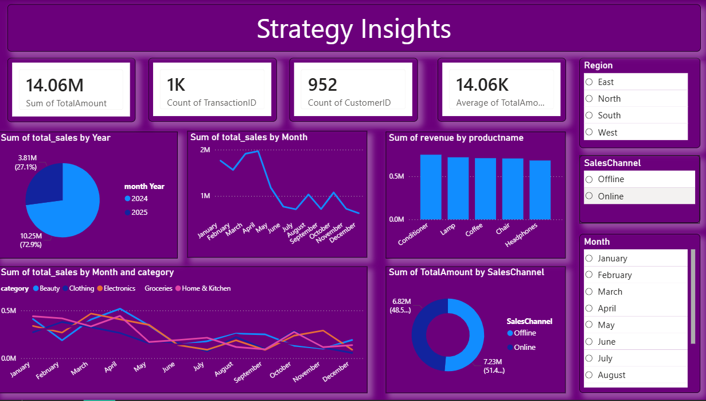

# Retail Transactions Analysis Dashboard

## Project Overview
This project focuses on analyzing a retail transaction dataset using PostgreSQL and Power BI.  
The dataset contains sales transaction records including products, categories, regions, sales channels, payment methods, and customer information.

The main objective of this project is to:
- Store retail data in PostgreSQL
- Perform SQL-based analysis
- Create interactive dashboards in Power BI
- Generate business insights from sales data

---

# Dataset Information

## File Name
`RetailTransactions.csv`

## Columns Included

| Column Name | Description |
|---|---|
| TransactionID | Unique transaction ID |
| Date | Transaction date |
| ProductName | Product sold |
| Category | Product category |
| Region | Sales region |
| SalesChannel | Online / Offline |
| Quantity | Units sold |
| UnitPrice | Price per unit |
| TotalAmount | Total transaction amount |
| PaymentMode | Payment method |
| CustomerID | Unique customer ID |

---

# Technologies Used

- PostgreSQL
- Power BI
- SQL
- CSV Dataset

---

# Database Setup

## Create Database

```sql
CREATE DATABASE retaildb;
```

## Connect Database

```sql
\c retaildb
```

## Create Table

```sql
CREATE TABLE RetailTransactions (
    TransactionID VARCHAR(20) PRIMARY KEY,
    Date DATE,
    ProductName VARCHAR(100),
    Category VARCHAR(50),
    Region VARCHAR(20),
    SalesChannel VARCHAR(20),
    Quantity INT,
    UnitPrice NUMERIC(10,2),
    TotalAmount NUMERIC(12,2),
    PaymentMode VARCHAR(30),
    CustomerID VARCHAR(20)
);
```

---

# Import CSV into PostgreSQL

```sql
COPY RetailTransactions(
    TransactionID,
    Date,
    ProductName,
    Category,
    Region,
    SalesChannel,
    Quantity,
    UnitPrice,
    TotalAmount,
    PaymentMode,
    CustomerID
)
FROM 'C:/path/RetailTransactions.csv'
DELIMITER ','
CSV HEADER;
```

---

# SQL Analysis Queries

## Total Revenue

```sql
SELECT SUM(TotalAmount) AS TotalRevenue
FROM RetailTransactions;
```

## Region Wise Sales

```sql
SELECT Region, SUM(TotalAmount) AS Sales
FROM RetailTransactions
GROUP BY Region;
```

## Category Wise Sales

```sql
SELECT Category, SUM(TotalAmount) AS Sales
FROM RetailTransactions
GROUP BY Category;
```

## Sales Channel Distribution

```sql
SELECT SalesChannel, SUM(TotalAmount) AS Sales
FROM RetailTransactions
GROUP BY SalesChannel;
```

## Monthly Sales Trend

```sql
SELECT 
    EXTRACT(MONTH FROM Date) AS Month,
    SUM(TotalAmount) AS Sales
FROM RetailTransactions
GROUP BY Month
ORDER BY Month;
```

---

# Power BI Dashboard



## Suggested Visualizations

- KPI Cards
  - Total Revenue
  - Total Transactions
  - Total Customers

- Charts
  - Category Performance Trend
  - Region Wise Sales
  - Sales Channel Distribution
  - Monthly Revenue Trend
  - Payment Mode Analysis

---

# Key Business Insights

## Most Valuable Customers
Customers with high purchase frequency and large transaction amounts contribute the highest revenue.

## Best Performing Products
Electronics and Home & Kitchen products show strong performance and growth.

## Online vs Offline
Online sales channels generally outperform offline sales in terms of revenue and transactions.

## Regional Performance
Low-performing regions may require additional marketing campaigns and customer engagement strategies.

---

# Conclusion

This project demonstrates how SQL and Power BI can be used together for retail sales analysis and business intelligence.  
The dashboard helps businesses make data-driven decisions by identifying trends, customer behavior, and sales performance.

---

# Author

Ansh
