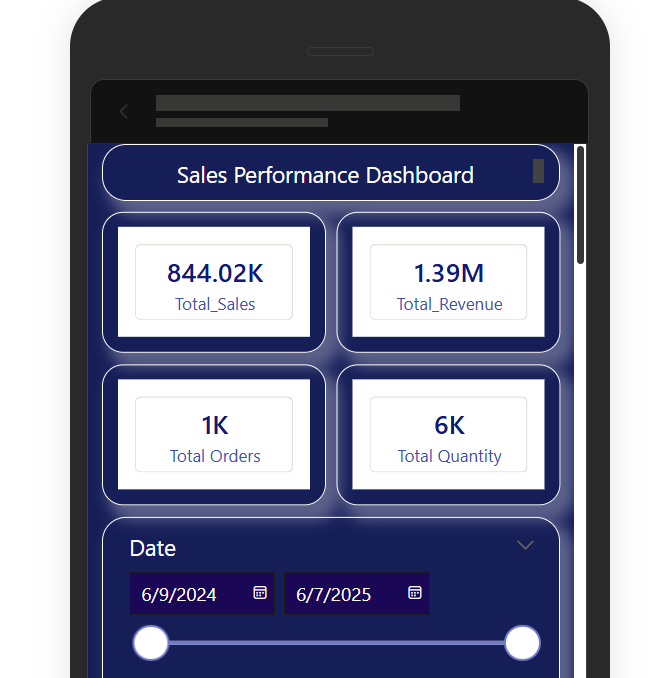
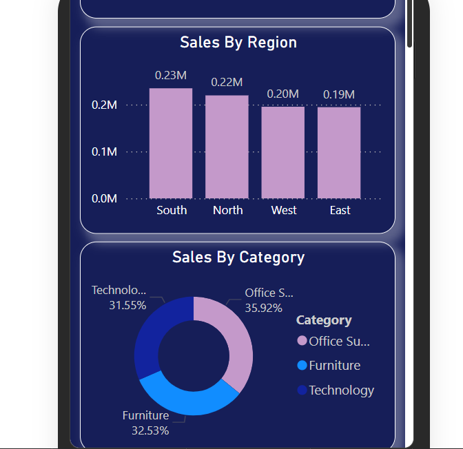
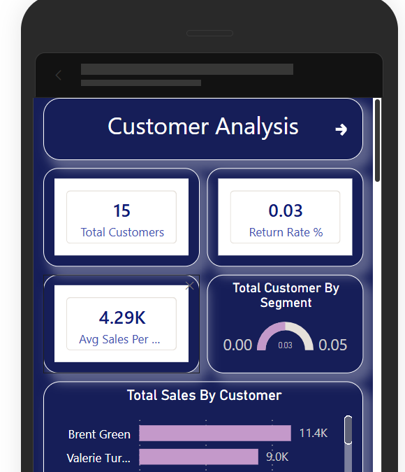
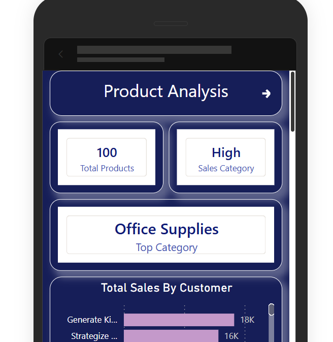

# 📊 Sales Performance Dashboard — Power BI End-to-End Project

A complete Power BI project covering Data Modeling, DAX Measures & Calculated Columns, Time Intelligence, and a fully interactive Multi-Page Dashboard with drillthrough, tooltips, and parameter pages.

---

## 🚀 Project Overview

A real-world Power BI reporting solution built on a Star Schema data model. The report includes four analysis pages, a drillthrough page, and a tooltip page — all styled with a dark navy theme for a polished, professional look.

---

## 🗂️ Project Files

| File Name | Description |
|-----------|-------------|
| 📄 `Sales_Dashboard.pbix` | Main Power BI file with all pages, DAX, and relationships |
| 📘 `README.md` | Project documentation (this file) |
| 📁 `File used sale` | Source files used in the project |
| 🖼️ `Dashboard Preview` | Preview screenshots for each report page |

---

## 📁 Data Sources & Tables

| Table | Type | Key Columns |
|-------|------|-------------|
| Sales_Fact | Fact | SaleID, CustomerID, ProductID, DateID, TotalAmount, UnitsSold |
| Customer_Dim | Dimension | CustomerID, FirstName, LastName, Region |
| Product_Dim | Dimension | ProductID, ProductName, Category, SubCategory, Price |
| Date_Dim | Dimension | DateID, Date, Month, Quarter, Year |
| Region_Dim | Dimension | RegionID, RegionName, ManagerName |
| Returns_Fact | Fact | ReturnID, SaleID, ReturnDate, ReturnReason |

---

## 🧩 Task Breakdown

### 🔹 Task 1 — Data Modeling

Constructed a clean Star Schema with `Sales_Fact` at the center, connected to all surrounding dimension tables.

**Relationships:**

| From Table | To Table | Join Key | Cardinality |
|------------|----------|----------|-------------|
| Sales_Fact | Customer_Dim | CustomerID | Many → 1 |
| Sales_Fact | Product_Dim | ProductID | Many → 1 |
| Sales_Fact | Date_Dim | DateID | Many → 1 |
| Sales_Fact | Region_Dim | RegionID | Many → 1 |
| Returns_Fact | Sales_Fact | SaleID | Many → 1 |

**Additional steps:**
- ✅ Applied single cross-filter direction on all relationships
- ✅ Hidden foreign key columns from Report View (e.g., CustomerID, ProductID in Fact tables)
- ✅ Marked `Date_Dim[Date]` as the primary date table

---

### 🔹 Task 2 — DAX Measures & Calculated Columns

#### 📐 Measures

**CALCULATE + FILTER** — Transactions where TotalAmount > 1000:


**ALL** — Top-selling category ignoring all active filters:
```DAX
Top Category =
CALCULATE(
    FIRSTNONBLANK(Product_Dim[Category], 1),
    TOPN(1, ALL(Product_Dim[Category]), [TOTAL SALES], DESC)
)
```

**SUMX + RELATED** — Revenue by multiplying units sold by product price:
```DAX
Total_Revenue =
SUMX(
    Sales_Fact,
    Sales_Fact[UnitsSold] * RELATED(Product_Dim[Price])
)
```

**AVERAGEX** — Average transaction amount:
```DAX
AVG SALES = AVERAGEX(Sales_Fact, Sales_Fact[TotalAmount])
```

**SWITCH** — Classify sales into High / Medium / Low buckets:
```DAX
SALES CATEGORY =
SWITCH(
    TRUE(),
    [TOTAL SALES] > 5000, "High",
    [TOTAL SALES] > 2000, "Medium",
    "Low"
)
```

#### 🧮 Calculated Columns

**Full Name** — Combining first and last name:
```DAX
Full Name =
Customer_Dim[FirstName] & " " & Customer_Dim[LastName]
```

**Year Month** — Date formatting:
```DAX
Year Month = FORMAT(Date_Dim[Date], "YYYY-MM")
```

**Margin Category** — Classifying products by profit margin:
```DAX
Margin Category =
SWITCH(
    TRUE(),
    [Profit Margin %] < 0.20, "Low Margin",
    [Profit Margin %] < 0.40, "Medium Margin",
    [Profit Margin %] < 0.60, "High Margin",
    "Super Margin"
)
```

---

### 🔹 Task 3 — Time Intelligence

**Year-over-Year % Change:**
```DAX
TotalAmount YoY% =
VAR __PREV_YEAR =
    CALCULATE(
        SUM('Sales_Fact'[TotalAmount]),
        DATEADD('Date_Dim'[Date], -1, YEAR)
    )
RETURN
    DIVIDE(SUM('Sales_Fact'[TotalAmount]) - __PREV_YEAR, __PREV_YEAR)
```

**Month-over-Month % Change:**
```DAX
TotalAmount MoM% =
VAR __PREV_MONTH =
    CALCULATE(
        SUM('Sales_Fact'[TotalAmount]),
        DATEADD('Date_Dim'[Date], -1, MONTH)
    )
RETURN
    DIVIDE(SUM('Sales_Fact'[TotalAmount]) - __PREV_MONTH, __PREV_MONTH)
```

**Year-to-Date Sales:**
```DAX
TotalAmount YTD =
TOTALYTD(SUM('Sales_Fact'[TotalAmount]), 'Date_Dim'[Date])
```

---

### 🔹 Task 4 — Dashboard Layout

#### 📄 Page 1 — Sales Performance Overview


The primary page displaying company-wide KPIs and overall sales trends.

**KPI Cards:** Total Sales: 844.02K &nbsp;|&nbsp; Revenue: 1.39M &nbsp;|&nbsp; Total Orders: 1,000 &nbsp;|&nbsp; Total Quantity: 5,502

**Visuals:**
- 📊 Bar Chart — Sales breakdown by Region
- 🍩 Donut Chart — Sales distribution by Category
- 📈 Area Chart — HIGH SALES vs TOTAL SALES by ProductID
- 📉 Line Chart — Total Sales by Year, Quarter, Month, Day

**Filters (Right Panel):** Date range &nbsp;|&nbsp; Full Name &nbsp;|&nbsp; RegionName &nbsp;|&nbsp; Category

---

#### 📄 Page 2 — Customer Analysis


Deep-dive into individual customer-level performance.

**KPI Cards:** Total Customers: 198 &nbsp;|&nbsp; Return Rate %: 0.05 &nbsp;|&nbsp; Avg Sales per Customer: 4.26K

**Visuals:**
- 📊 Horizontal Bar Chart — Total Sales by Customer Name
- 📋 Table — Full Name, Total Sales, Total Returns
- 🍩 Donut Chart — Customer distribution by Segment
- 🎯 Gauge Chart — Return Rate %

**Filters:** Region &nbsp;|&nbsp; Segment (Consumer, Corporate, Home Office) &nbsp;|&nbsp; Year (2024, 2025)

---

#### 📄 Page 3 — Product Analysis


Product-level breakdown across all categories.

**KPI Cards:** Total Products: 100 &nbsp;|&nbsp; Sales Category: High &nbsp;|&nbsp; Top Category: Office Supplies

**Category Summary:**

| Category | Total Sales | Total Products | Total Quantity | Revenue |
|----------|-------------|----------------|----------------|---------|
| Furniture | 2,74,569.59 | 35 | 1,805 | 4,87,334.73 |
| Office Supplies | 3,03,150.69 | 34 | 1,943 | 5,27,766.96 |
| Technology | 2,66,296.67 | 31 | 1,754 | 3,74,700.74 |
| **Total** | **8,44,016.95** | **100** | **5,502** | **13,89,802.43** |

**Visuals:**
- 📊 Horizontal Bar Chart — Total Sales by ProductName
- 📋 Summary Matrix — Category × Sales, Products, Quantity, Revenue

**Filters:** Category (Furniture, Office Supplies, Technology) &nbsp;|&nbsp; Year (2024, 2025)

---


#### 📄 Page 4 — Drillthrough Page


Context-sensitive drillthrough for customer-level return analysis.

> **How to trigger:** Right-click any customer on another page → Drillthrough → Drillthrough Page

**KPI Cards:** Total Returns &nbsp;|&nbsp; Return Rate % &nbsp;|&nbsp; YTD Returns

**Visuals:**
- 📊 Bar Chart — Total Returns by ReturnReason
- 📋 Detail Table — ReturnID, Full Name, ProductName, ReturnReason

---

#### 📄 Page 5 — Tooltip Page


A compact tooltip card that appears on hover across report visuals.

- Displays: **Total Sales: 844.02K** and **Total Returns: 50**
- Configured as a custom tooltip across all Sales Performance page visuals

---


#### Mobile Layout 





## 📌 Key Insights

- ✅ South region leads in total sales at 0.23M, followed closely by North at 0.22M
- ✅ Office Supplies is the top-performing category with ₹3,03,150 in total sales
- ✅ Michael Rich and Brent Green are the top two customers by total sales
- ✅ Return rate is very low at 0.05% — indicating strong customer satisfaction
- ✅ "Customer Changed Mind" is the most frequent return reason (visible via drillthrough)
- ✅ Sales peaked around Nov 2024 – Jan 2025 in the time series trend

---


## 🛠️ Tools & Features Used

| Tool / Feature | Usage |
|----------------|-------|
| Power BI Desktop | Report authoring, model view, DAX editor |
| Power Query | Data type cleanup, column renaming, null removal |
| DAX | Measures, Calculated Columns, Time Intelligence |
| Field Parameters | Dynamic measure switching on Page 4 |
| Drillthrough | Customer-level return detail on Page 5 |
| Custom Tooltip | KPI hover card on Page 6 |
| Star Schema | Central Sales_Fact with 4 surrounding dimension tables |
| Bookmarks | Page-level navigation and view switching |
| Conditional Formatting | Applied across key metric columns |
| Mobile Layout | Vertical layout for Power BI mobile app |

---

## 👨‍💻 Ansh Patoliya

📍 Ahmedabad, Gujarat

⭐ If this project was helpful, feel free to star the repository and fork it!

🗂️ Clean Models · Sharp DAX · Confident Insights